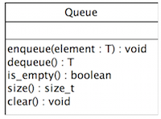

Looks Can Be Deceiving
=========================
In the previous assignment, you designed and implemented a standard array
class. The purpose of the array class is to serve as a Wrapper Facade for
C++ arrays. In this assignment, you will use the Array class to implement
three more ADTs:

* **Stack.** An ADT that contains a list of elements such that the list has
last-in, first-out (LIFO) semantics, i.e., elements are inserted into the
front of the list and removed from the front of the list;

* **Queue.** An ADT that contains a list of elements such that the list has
first-in, first-out (FIFO) semantics, i.e., elements are inserted into the
of the list and removed from the front of the list; and

* **Fixed Array.** An ADT that is an array, but contains a fixed set of 
elements (i.e., is not able to grow or shrink).

In addition, you will implement each of the ADTs listed above using C++ templates. 
This will allow each ADT to work with arbitrary data types. When you download the 
assignment files (see below), you will notice that there are no shell files for 
Queue. This is because it is your job to define and implement the Queue class in 
C++. 



When defining the Queue, make sure you follow the design in the figure above, and 
implement the default constructor, copy constructor, destructor, and assignment 
operator although they are not highlighted in the figure. More specifically, please 
implement each method in Figure 1 using the following specification:

* enqueue – adds the element to the end of the list;

* dequeue – removes the element at the front of the list. If there are not 
elements in the queue, this method throws empty exception, similar to the 
stack;

* is_empty – test if the queue is empty. If the queue is empty, then this method 
returns true. Otherwise, this method returns false;

* size – returns the number of elements in the queue; and

* clear – removes all the elements in the queue.

Assignment Files
------------------
The source code shell(s) can be forked from IU Github. For information
on generating the project workspace and building the project, please see
the Wiki for the Array assignment.

Submissions
------------------
Submit all source files (.cpp, .inl, and .h), project files (.mpc and .mwc),
and Valgrind report must be submitted via Github. The Valgrind report *must*
be placed in a file named ```valgrind-report.out```.
